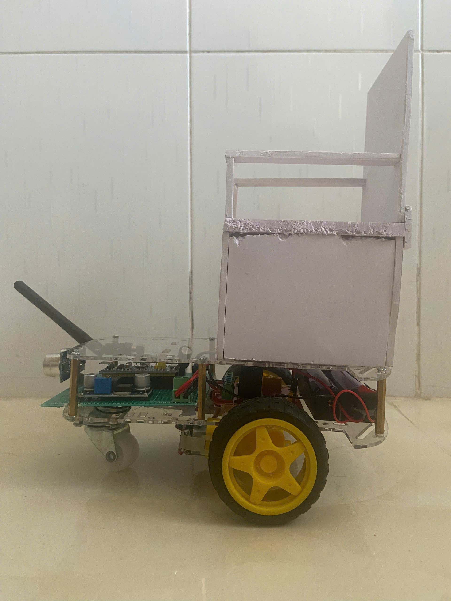
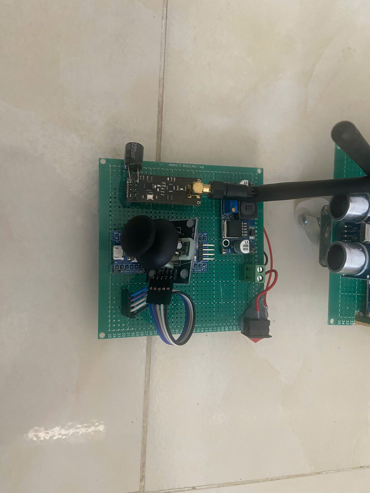
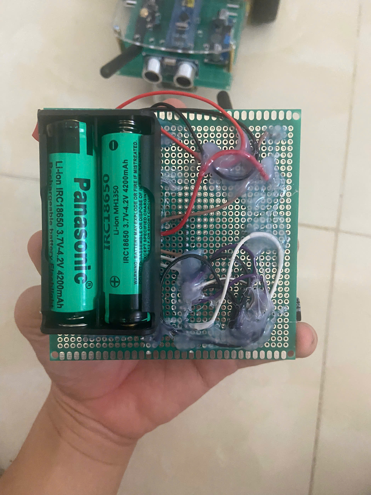
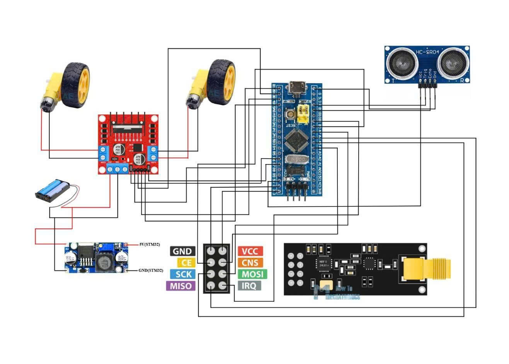
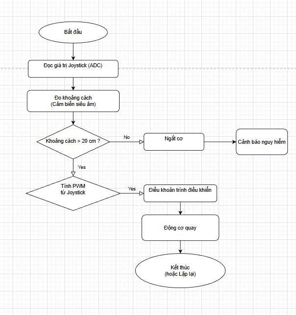

# Wheelchair Joystick Control System ♿🕹️

Dự án thiết kế hệ thống điều khiển xe lăn bằng Joystick sử dụng vi điều khiển STM32. Hệ thống được chia thành hai module hoạt động song song: Bộ điều khiển cầm tay (Controller) và Bộ vi xử lý trung tâm điều khiển động cơ trên xe (Car).

## 🌟 Hình ảnh sản phẩm thực tế
*(Bao gồm hệ thống xe lăn và bo mạch tay cầm điều khiển Joystick)*







---

## 🛠️ Yêu cầu phần cứng (Hardware Requirements)
* **Microcontroller:** Khuyến nghị sử dụng các dòng STM32 (ví dụ: STM32F103C8T6 Blue Pill hoặc STM32F4 series).
* **Controller Node:** Module Analog Joystick.
* **Car Node:** Motor Driver module (L298N, BTS7960, v.v.), Động cơ DC.
* **Communication:** Giao tiếp giữa 2 node (UART / Bluetooth HC-05 / NRF24L01...).

## 💻 Yêu cầu phần mềm (Software Requirements)
* **STM32CubeIDE** - Môi trường lập trình và biên dịch chính (Dự án không sử dụng Arduino IDE).
* **C/C++ Compiler** cho ARM.

---

## ⚙️ Sơ đồ mạch (Hardware Schematic)
*(Bản vẽ sơ đồ đấu nối phần cứng của hệ thống)*



---

## 🔄 Luồng hoạt động (System Workflow)
*(Lưu đồ thuật toán truyền nhận và xử lý tín hiệu)*



---

## 📁 Cấu trúc thư mục (Project Structure)
```text
📦 Wheelchair-Joystick-Control-System
 ┣ 📂 Code_Car           # Chứa source code cho vi điều khiển trên xe (Nhận tín hiệu & xuất PWM điều khiển động cơ)
 ┣ 📂 Code_Controller    # Chứa source code cho tay cầm Joystick (Đọc ADC & truyền tín hiệu)
 ┣ 📂 image              # Chứa tài liệu hình ảnh minh họa
 ┗ 📜 README.md
